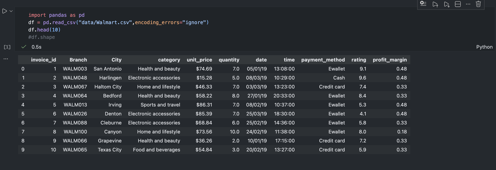
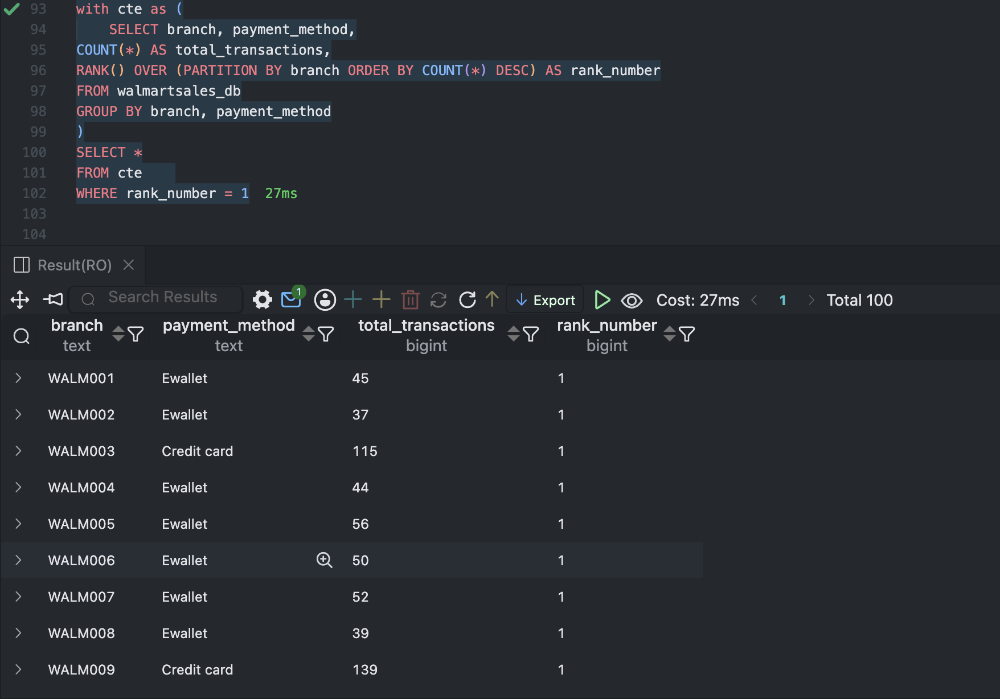
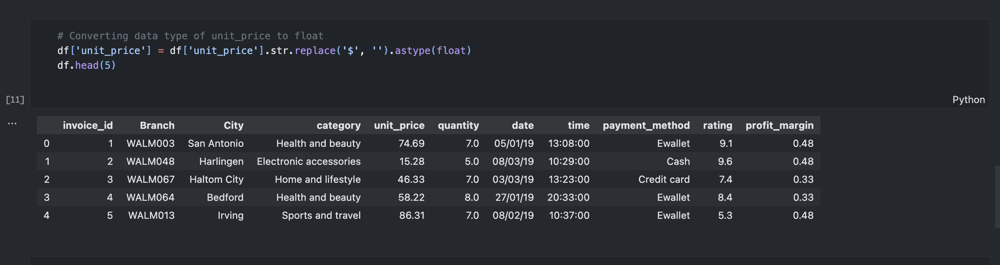
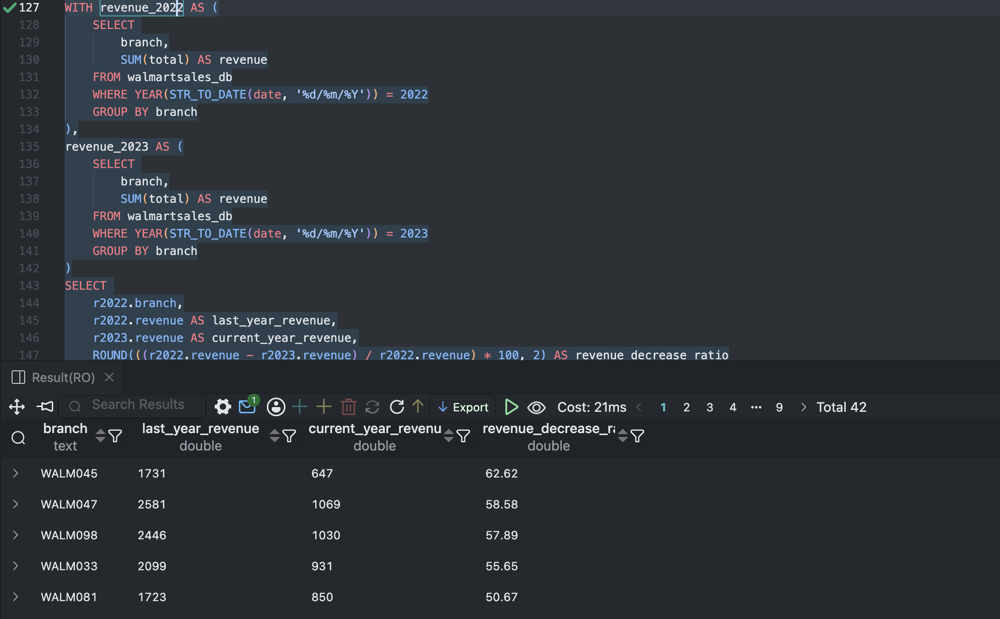
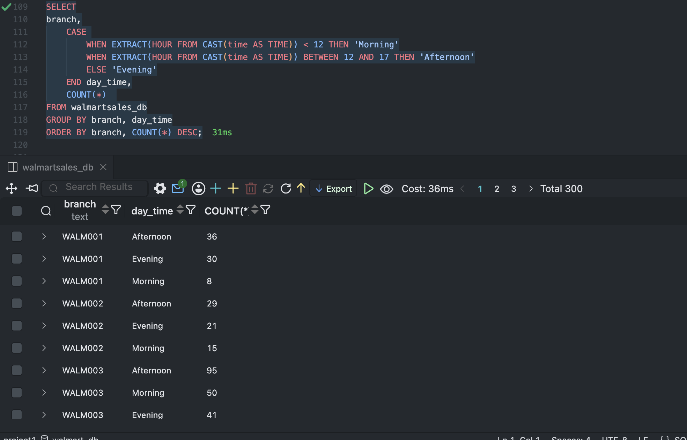

# Walmart Sales Analysis using Pandas and SQL

A comprehensive data analysis project for Walmart sales data using Python (Pandas) and SQL.

## Project Overview

This project analyzes Walmart sales data through:
- **Data Cleaning & Processing** - Using Pandas in Python
- **SQL Analysis** - Complex queries for business insights
- **Data Visualization** - Interactive visualizations and dashboards

## Files

- `project.ipynb` - Main Jupyter notebook with Python and Pandas analysis
- `walmart-sales-analysis.sql` - SQL queries for database analysis
- `data/` - CSV files containing Walmart sales datasets
  - `Walmart.csv` - Raw sales data
  - `cleaned_walmart.csv` - Processed and cleaned data

## Key Analysis Includes

1. **Payment Method Analysis** - Transaction count and total sales by payment method
2. **Branch Performance** - Revenue and sales metrics by branch
3. **Category Ratings** - Highest-rated categories by branch
4. **Time Analysis** - Busiest days and time shifts (Morning/Afternoon/Evening)
5. **Profit Analysis** - Category-wise and branch-wise profit calculations
6. **Year-over-Year Comparison** - Revenue trends between 2022 and 2023

## Technologies Used

- **Python** - Pandas, NumPy
- **SQL** - MySQL with advanced queries (CTEs, Window Functions, Ranking)
- **Jupyter Notebook** - Interactive analysis and visualization
- **Database** - MySQL

## Getting Started

### Requirements
```bash
pip install pandas sqlalchemy pymysql jupyter
```

### Database Setup
```sql
CREATE DATABASE walmart_db;
USE walmart_db;
-- Run queries from walmart-sales-analysis.sql
```

### Run Analysis
1. Open `project.ipynb` in Jupyter Notebook
2. Execute cells to load and analyze data
3. Query MySQL database using SQL queries in `walmart-sales-analysis.sql`

## Data Schema

Table: `walmartsales_db`
- Branch, City, Customer_type, Gender
- Product_line, Category
- Date, Time
- Unit_price, Quantity, Total
- Payment_method
- COGS, Profit_margin
- Rating

## Screenshots

### Dataset Preview
<p align="center">
  
</p>

---

### Branch payment method
<p align="center">
  
</p>

---

### Data type conversion
<p align="center">
  
</p>

---

### revenue drop analysis
<p align="center">
  
</p>

---

### Sales shift analysis
<p align="center">
  
</p>

